# Qwen Autopilot Ops

**Autonomous Incident Remediation & Memory Engine**  
*Built for the Global AI Hackathon with Qwen Cloud ($70,000+ Series)*

Qwen Autopilot Ops is a production-ready, multi-agent operations platform that automates IT incident remediation (e.g. database failures, high CPU loads, disk constraints) using flagship models on the **Qwen Cloud** infrastructure. It showcases cognitive capabilities across three key hackathon tracks:
1. **Track 4: Autopilot Agent** – Automates end-to-end system remediation workflows with tool call actions and built-in human-in-the-loop (HITL) check-ins for high-risk executions.
2. **Track 3: Agent Society** – Orchestrates multiple specialised agents (Triage, Remediation Planner, Health Verification) executing sequential logic and negotiation.
3. **Track 1: MemoryAgent** – Accumulates remediation experience in a persistent cognitive store (SQLite) to improve decision accuracy over time based on historical successes.

---

## 🏗️ System Architecture

```mermaid
graph TD
    User([System Alert / Email]) -->|Trigger Alert| Backend[FastAPI Backend]
    Backend -->|Triage Task| TriageAgent[Triage Agent - Qwen-Plus]
    TriageAgent -->|Analyze logs / Parse severity| MemoryStore[(Persistent Memory DB)]
    MemoryStore -->|Recall historical fixes| RemediationAgent[Remediation Agent - Qwen-Max]
    RemediationAgent -->|Formulate plan & select tools| Decision{Requires HITL?}
    
    Decision -->|Yes: High Risk| WebUI[Glassmorphic Operations Dashboard]
    Decision -->|No: Low Risk| Executor[System Executor]
    
    WebUI -->|User Approves / Rejects| Executor
    Executor -->|Run shell script / API call| VerifyAgent[Verification Agent - Qwen-Plus]
    VerifyAgent -->|Check service health| Backend
    Backend -->|Archive incident log| OSS[Alibaba Cloud OSS]
    
    style WebUI fill:#0d1527,stroke:#3b82f6,stroke-width:2px;
    style OSS fill:#162312,stroke:#10b981,stroke-width:2px;
```



---

## ☁️ Alibaba Cloud Integration Proof

To satisfy the **Proof of Alibaba Cloud Deployment** requirement, this project integrates with the official **Alibaba Cloud Object Storage Service (OSS)** to persist resolved incident records and logs.
* **Proof Location**: [backend/alibaba_cloud_proof.py](backend/alibaba_cloud_proof.py) (uses the official `oss2` python library to upload structured logs).
* Completed logs are saved as `.json` files in the OSS bucket with structured request verification keys.

---

## ⚡ Quick Start

This project contains a **High-Fidelity Mock Mode** enabled automatically if no Qwen Cloud API credentials are provided. This ensures that judges can run the system and see complete agent reasoning traces, UI cards, and tools execution immediately on first run.

### 1. Installation
Ensure you have Python 3.8+ installed.

```bash
# Clone the repository
git clone <your-repo-url>
cd qwen-agent-ops

# Install backend dependencies
pip install -r backend/requirements.txt
```

### 2. Configure Environment Variables (Optional)
To use real Qwen Cloud APIs, set the following keys:

```bash
# Qwen Cloud API Configuration (compatible with OpenAI SDK)
export DASHSCOPE_API_KEY="your-dashscope-api-key"
export DASHSCOPE_BASE_URL="https://dashscope-intl.aliyuncs.com/compatible-mode/v1"

# Alibaba Cloud OSS Configuration
export ALIBABA_CLOUD_ACCESS_KEY_ID="your-access-key-id"
export ALIBABA_CLOUD_ACCESS_KEY_SECRET="your-access-key-secret"
export ALIBABA_CLOUD_OSS_ENDPOINT="oss-cn-singapore.aliyuncs.com"
export ALIBABA_CLOUD_OSS_BUCKET="qwen-autopilot-incident-logs"
```

*Note on Windows PowerShell, use `$env:DASHSCOPE_API_KEY="value"`*

### 3. Run the Application
Start the FastAPI server which also hosts the static glassmorphic frontend:

```bash
python -m backend.main
```

Open your browser and navigate to:  
👉 **[http://localhost:8000](http://localhost:8000)**

---

## 🕹️ Submission Showcase & Testing Guide

When record your 3-minute video presentation, follow this workflow:

1. **Inject an Alert**: Click the **Disk Full** template button in the left panel, and click **Dispatch Alert to Qwen OS**.
   * *Flow*: Since this is a low-risk alert, Qwen-Max will auto-approve the cleanup. The stream shows Triage parsing -> Remediation Planner selecting `clear_disk_space` -> Execution logs clearing files -> Verification resolving it.
2. **Inject a High-Risk Alert**: Click the **MySQL Connection Failure** template, and click Dispatch.
   * *Flow*: Since restarting a database on a production host is high-risk, the system triggers the **Human-in-the-Loop Checkpoint**.
   * *HITL Interaction*: An orange warning card pops up on the right panel. Review the plan, click **Approve Execution**.
   * *Verification*: Observe the execution logging and the subsequent green resolved state.
3. **Verify Memory Bank & OSS**: 
   * Review the **Persistent Memory Bank** showing the success rate incrementing.
   * Check the **Alibaba Cloud OSS** list showing the archived logs.
