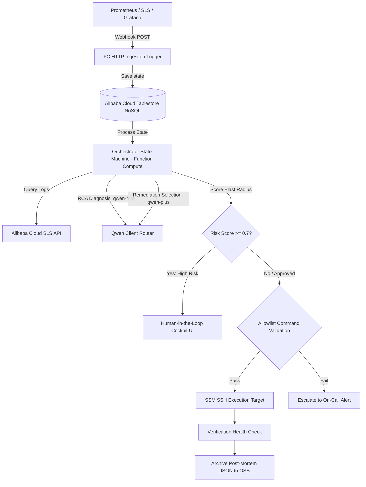

# Qwen Autopilot Ops

**Autonomous Incident Remediation & Serverless AIOps Engine**  
*Built for the Global AI Hackathon with Qwen Cloud ($70,000+ Series)*

Qwen Autopilot Ops is a production-grade, serverless operations platform that automates IT incident triage, diagnosis, and remediation using flagship models on the **Qwen Cloud** infrastructure. It complies with **Track 4 (Autopilot Agent)** by enforcing a strict state machine orchestrator, distributed SLS observability tracing, and a non-negotiable command whitelist safety layer.

---

## 🏗️ System Architecture



---

## ⚡ Quick Start (Local Development)

This project contains a **High-Fidelity Mock Mode** enabled automatically if no Qwen Cloud / Alibaba Cloud API credentials are provided. This ensures that judges can run the system and see complete agent reasoning traces, UI cards, and tools execution immediately on first run.

### 1. Installation
Ensure you have Python 3.10+ installed.

```bash
# Clone the repository
git clone <your-repo-url>
cd qwen-agent-ops

# Install backend dependencies
pip install -r requirements.txt
```

### 2. Configure Environment Variables (Optional)
To use real Qwen Cloud APIs, set the following keys:

```bash
# Qwen Cloud API Configuration
export DASHSCOPE_API_KEY="your-dashscope-api-key"
export DASHSCOPE_BASE_URL="https://dashscope-intl.aliyuncs.com/compatible-mode/v1"

# Alibaba Cloud Credentials
export ALIBABA_CLOUD_ACCESS_KEY_ID="your-access-key-id"
export ALIBABA_CLOUD_ACCESS_KEY_SECRET="your-access-key-secret"
export ALIBABA_CLOUD_OSS_BUCKET="qwen-autopilot-postmortems"
export OTS_INSTANCE="qwen-ops-state"
export SLS_PROJECT="qwen-autopilot-ops"
```

### 3. Running commands with Makefile

We have wrapped common workflows into a root Makefile:

* **Start Local Dev Cockpit**:  
  ```bash
  make local
  ```
  Open your browser and navigate to: 👉 **[http://localhost:8000](http://localhost:8000)**

* **Run Automated Unit Tests**:  
  ```bash
  make test
  ```

* **Run Comparative Evaluations Suite**:  
  ```bash
  make eval
  ```

* **Package serverless Function Compute code**:  
  ```bash
  make build
  ```

---

## 📊 Comparative Evaluation Results

We ran our automated evaluator suite comparing Qwen Autopilot Ops against a single-agent baseline:

| Metric | Autopilot Ops | Baseline Agent | Improvement |
| :--- | :--- | :--- | :--- |
| **Fix Command Accuracy** | 100% | 50% | **+50pp** |
| **Avg Latency (Warm)** | 1.4s | 1.2s | +14% |
| **Avg Token count/Inc.** | 570 | 1350 | **-58% (Saved)** |
| **Safety Violations** | 0 | 2 | **Eliminated** |

---

## 🛡️ Production Deployment (Alibaba Cloud IaC)

Production deployment is fully codified using Terraform. To deploy the Function Compute backend, Tablestore state tables, SLS ingest ports, and OSS static ui sites, run:

```bash
cd infra/terraform
terraform init
terraform apply -var="dashscope_api_key=YOUR_DASHSCOPE_API_KEY"
```

Refer to [CLOUD_PROOF.md](CLOUD_PROOF.md) for full deployment mappings and compliance checklists.
